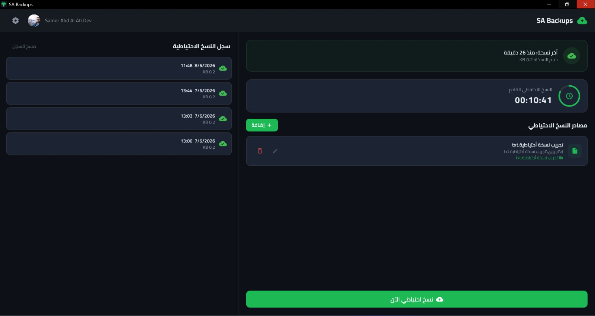
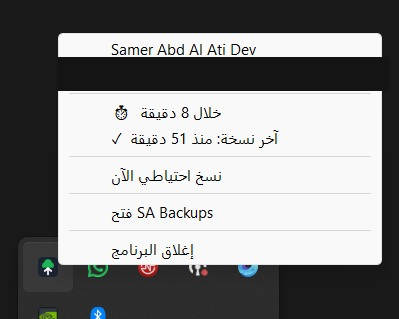

# SA Backups

**Automatic, scheduled Windows backups to Google Drive — set it and forget it.**

---

## What it does

SA Backups sits quietly in your Windows system tray and keeps your important folders and files backed up to Google Drive on a schedule you control — hourly, daily, weekly, or the moment a watched file changes. No manual zipping, no remembering to copy files, no cloud storage clients to babysit.

## Download for Windows

**[⬇ Download the latest release (Windows x64)](https://github.com/SamerAbdAlAti/sa-backups-showcase/releases/latest)**

- Requires **Windows 10 or 11, 64-bit**
- Portable — unzip and run `sa_backups.exe`, no installer required
- If the app doesn't launch, install the latest **Microsoft Visual C++ Redistributable (x64)** (a common one-time requirement for Windows desktop apps)

> **Note:** This is a public demo build. Google Drive sign-in is intentionally disabled in this build for security reasons (see [About](#about) below) — the interface and local backup features are fully explorable.

## Screenshots

   
  <em>Dashboard — backup sources, live countdown to the next run, and history log</em>

   
  <em>Runs quietly from the system tray — backup on demand, status at a glance</em>

*(more screens coming soon)*

## Key Features

- 🔄 **Scheduled automatic backups** — choose an interval from every minute up to weekly
- ☁️ **Direct upload to Google Drive** — organized automatically into per-target folders
- 👀 **Live file-watching mode** — trigger a backup the moment a watched file changes, instead of waiting for the next interval
- 🗂️ **Multiple backup targets** — mix and match individual files and whole folders
- 🧹 **Automatic retention cleanup** — keeps only the N most recent backups per target, deletes the rest
- 📜 **Backup history log** — see what ran, when, and whether it succeeded
- 🔔 **Native Windows integration** — system tray icon, background operation, launch-at-startup, desktop notifications
- 🌗 **Light/dark theme**, fully right-to-left Arabic interface
- 🔒 **Single-instance safe** — launching a second copy just focuses the running one

## Tech Stack

- **Framework:** Flutter (Windows desktop target)
- **Language:** Dart
- **Architecture:** Clean Architecture, feature-first (data / domain / presentation per feature)
- **State management:** flutter_bloc (Cubit)
- **Dependency injection:** get_it
- **Cloud integration:** Google Drive API v3 via `googleapis` / `googleapis_auth`, OAuth 2.0
- **Native Windows integration:** `window_manager`, `tray_manager`, `launch_at_startup`

## About

SA Backups is a real, actively-used production application — this repository is a public showcase of it. **The source code is kept private**; this repo contains only documentation and a downloadable Windows build with cloud sign-in disabled, so the app can be explored safely without exposing implementation details or live credentials.

## My Role

Designed and built solo, end-to-end: architecture, all four feature modules (auth, backup targets, scheduling/settings, backup execution), the Google Drive integration, the background scheduler and file-watcher services, native Windows system-tray/startup integration, and the full Arabic RTL UI.

---

Built by **Samer Abd Al Ati**

